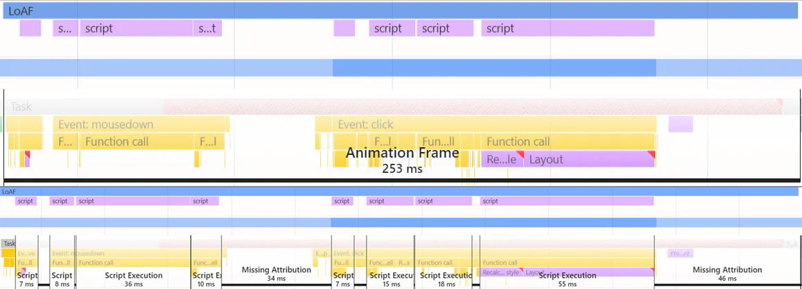
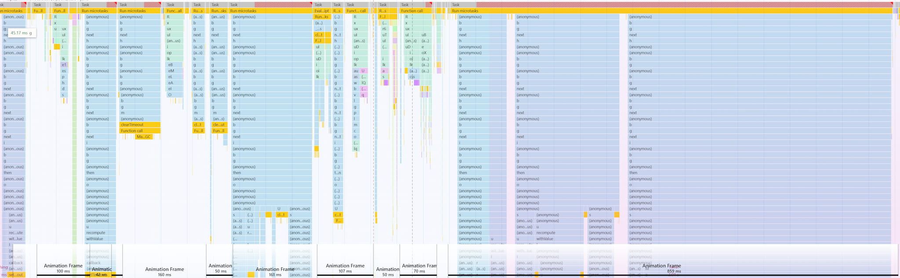
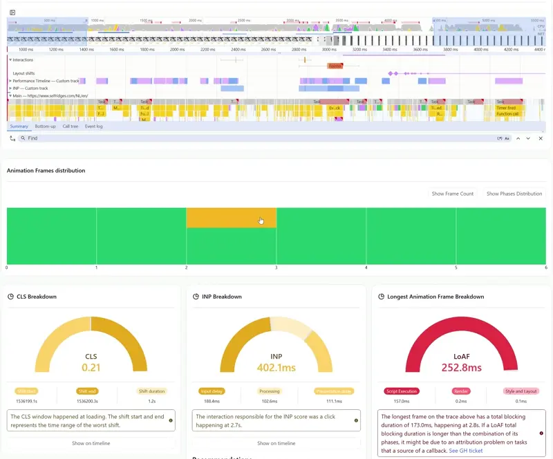

# What is an AnimationFrame and what can it tell you?

Modern web applications need to be responsive and smooth, providing users with immediate feedback for their interactions. To understand how our applications perform, we need to understand how browsers process and render content. This is why we now have animation frame, the base model that powers INP and LoAF APIs!

We will be talking about concepts surrounding the JS runtime and its components and some of its parts such as tasks and microtasks. For a catchup on all of those concepts there’s a [great video by Lydia Hallie](https://www.youtube.com/watch?v=eiC58R16hb8) that goes into great depths explaining all of those concepts on a very approchable way.

## What is an animation frame?

An animation frame represents the complete cycle of work the browser performs in order to present a new frame on the screen. This work may include work such as processing possible user input, execute code (tasks and microtasks), process styling and layout and finally contructing and rendering a new frame. Think of an animation frame as a snapshot of all the work needed to generate visual updates for your users.

This work encompasses all three phases of the INP attribution, which are: input delay, processing time and presentation delay. But from an animation frame perspective they can be measured more granularly within its attribution model. Animation frames are present session wide, and for that it can be considered as a good candidate for a base unit of work when it comes to how users will perceive their experience.

Encompassing all different kinds of work a browser will create and execute before shipping a frame to the screen. Sometimes the work executed within some of the frames might extend past a budget established in order to maintain a smooth experience. In which case any animation frame that extend past a 50ms budget would be considered a [long animation frame](https://developer.chrome.com/docs/web-platform/long-animation-frames), or LoAF, entry.

Since most of us will attribute LoAF entries to INP attribution data, its important to mention that animation frames are not required to be preceeding or encompassing an interaction. As they are purelly measuring different types of work, and collecting timestamps of interaction events, that happened before the browser could ship the next frame.

Visualizing an animation frame vs the different work executed during its span on https://perflab.io

## Breaking down different types of work within an animation frame entry

From an animation frame perspective work is divided into different milestones where you’d have timings and attribution data to account for. Each aggregated into its own part of the attribution model. An animation frame will include different timestamps or timespans for things like: interaction event creation; script compilation; script execution; style and layout work and render work.

Its important to note that parts of the attribution model [may not be present in some animation frames](https://developer.chrome.com/docs/web-platform/long-animation-frames#no-script), either by lack of activity related to the missing data or due to different limitations currently faced by the platform to accurately or safely infer the needed data.

Lets breakdown each phase of the attribution model and help paint a complete picture of the work being done.

### `firstUIEventTimestamp` or INPut delay

As mentioned above, an animation frame is not always connected to an interaction. But when an interaction event happens it will be represented by the [`firstUIEventTimestamp` attribute](https://developer.chrome.com/docs/web-platform/long-animation-frames#frame_timestamps_and_durations). That is the timestamp for the first interaction event to be processed within a given animation frame. This interaction timestamp represent the interaction event creation, which might be any point in time within the current or previous animation frame. This attribute provides the data used to calculate any input delay incurred for animation frames that are connected to the INP attribution.

### Processing time

The processing time encompasses work on the main thread related to tasks or micro tasks executed during the animation frame. If inspected via the profiler, this group of work will be represented on a trace by work such as:

- Script compilation
- different function calls and callbacks
- Promise resolution
- Timer callback functions (`setTimeout`, `setInterval`)
- Forced Style and Layout (see [web.dev article](https://web.dev/articles/avoid-large-complex-layouts-and-layout-thrashing) and [this gist by Paul Irish](https://gist.github.com/paulirish/5d52fb081b3570c81e3a) for more on the matter)

### Presentation delay

The last section of work before the browser can produce and ship the next frame is any work related to process the visual updates needed after the main thread has finished executing all the tasks for the cycle. This type of work encompasses the presentation delay, and it is composed different parts like style and layout work. But style and layout is not the only type of work being processed at this stage, other different APIs are executed around the stage between a task execution and a frame being presented to the screen. Work such as:

- CSS selector evaluation and style computations
- Resize observer callbacks
- View transition promises
- RequestAnimationFrame callbacks

The work executed at this stage runs a lot closer to the part of the animation frame that is closer to actually presenting a frame, but they also can contribute delays before the new frame can actually be presented. Since some of those APIs also spawn their own tasks and microtasks, thus the work executed at this stage can also be a source of delay.

### Thinking in terms of Animation Frames

Screenshot taken from a trace visualized in https://perflab.io

[Back in 2021](https://web.dev/blog/better-responsiveness-metric), in order to empower the next set of metrics and improve the attribution model, the chrome team started resarch and development around a new stardard way to measure work around user interactions. A year later INP became an experimental metric and in [March 2024 it replaced FID](https://web.dev/blog/inp-cwv-march-12)**.** Along side INP we also got [Long Animatin Frames](https://github.com/w3c/long-animation-frames) which is where we started agregating the INP phases into a new attribution data in the form of the Long Animation Frame entries exposed as [part of the Performance APIs](https://developer.mozilla.org/en-US/docs/Web/API/Performance_API/Long_animation_frame_timing).

Similar to the LongTasks API, the LoAFs API exposes entries that are above the mentioned 50ms threshold. Allowing developers to focus on collecting data that may point to bottlenecks around their applications.

However, we can also expand the concept to thinking around animation frames as a base unit of work. Enabling some exploration shown bellow on how to quickly expose possible bottlenecks within your application on a session wide scope. Instead of zooming into one singular point exposed by your INP score and attribution data.

Showcasing INP event attribution data vs animation frame distribution and work type aggregation on https://perflab.io

Framing where different problem areas may be presented at different times over the entire session, and gathering information on what kind of work is being done to cause such bottlenecks at any given stage of work mentioned above.

Not only does animation frames helps us visualize work from a more user-centric perspective, by making us think of stages of work executed before presenting a new frame with visual updates. It allows us to aggregate the work done at those stages within the attribution model, and highlight possible problems per stage. Creating a more productive workflow for development teams when it comes investigative work.

### Interactions within animation frames

As we have established, animation frames happen session wide. They are a unit of work we can use to measure total latency to present a frame and it contains attribution data necessary to understand all the work that happen for the duration. So lets reiterate.

Considering that our users may also interact with our website at any given time, meaning those interactions may be initiated anytime during an animation frame. So if the event creation happens during the processing time section of an animation frame, the interaction event creation may not be followed by its event handler’s tasks during the same frame.

](inp-image.jpg)

A visualization of an animation frame that contains input delay taken from the [https://web.dev INP article](https://web.dev/articles/inp)

It’s important to separate the concept of an interaction and event handlers, as [one interaction may include multiple event handlers](https://web.dev/articles/inp#whats_in_an_interaction) such as `keydown`, `keypress`, and `keyup` events for a single keystroke instance. Each may need to process their own event handler’s tasks. And in some cases each event may even be processed over different animation frames, if the browser gets to present a frame to the screen between handling any callbacks for each separate event.

Meaning that each could either be part of the input delay or processing time from an animation frame prespective.

### Looking at the whole picture

Event handlers and its tasks or micro tasks spawn from them are only an isolated part of a larger context when it comes to how our users perceive their experience. Performance problems may have any combination of those as attribution to why things are slow, and by now we have really good metrics and APIs to help us gather this information. But the actual problem, and often the key of why things happened, convey a larger context that is lost if you only think about the individual pieces.

That is why animation frames can be a great candidate to help create a more productive discussion around performance problems by initially aggregating them into one of its different phases and helping development teams get more confidance and a better workflow for their performance tasks.
